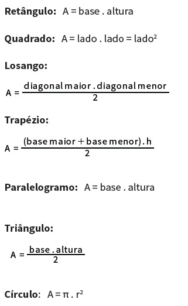

# Hora de Codar 5 - O Inimigo agora é outro!
Estamos nos primeiros passos de lógica de programação, só que agora em JAVA
Exercícios: 

# 1 - Baby Steps
Escreva um programa em Java e crie uma variável chamada "Planeta" e atribua-a um valor "Plutão". 
Exiba o valor para o usuário.
# 2 -  Hello Clarice
Escreva um programa em Java em que o usuário informe o seu nome e exiba a mensagem "Olá, [NomeDoUsuario]".
# 3 - A Bit of Information
Escreva um programa em Java em que o usuário informe o seu nome e em seguida o programa perguntará a idade do usuário. Agora o programa deve exibir a mensagem "Olá, [NomeDoUsuario], sua idade é [idade]".
# 4 - A Bit of Geometry
Considerando a figura abaixo, escreva um programa para cada forma que calcule e exiba em tela cada uma de suas respectivas áreas. O usuário irá informar os valores de cada variável. Crie um arquivo para cada fórmula e poste os  arquivos no GitHub.
 Áreas de Figuras Planas: 

# 5 - 1, 2 e 3
Faça um programa que leia um valor informado pelo usuário e diga se o valor informado é positivo, negativo ou neutro.
# 6 - Qual o maior?
Faça um programa para ler 3 valores (considere que não serão informados valores iguais) e escrever o maior deles. 
# 6.1 - Qual o maior? (4 vezes pior)
Faça um programa para ler 4 valores (considere que não serão informados valores iguais) e escrever o maior deles.
# 7 - Qual o quê?
Faça um programa que leia  3 valores (considere que não serão informados valores iguais) e escrever a soma dos 2 maiores. 
# 7.1 - 5 vezes?
Faça um programa que leia 5  valores (considere que não serão informados valores iguais) e escrever a soma dos 2 maiores.
# 8 - Enquanto isso
Faça um programa para ler 2 valores informados pelo usuário e se o segundo valor informado for neutro, deve ser lido um novo valor - ou seja, para o segundo valor não pode ser aceito o valor zero nem um valor negativo. O programa deve imprimir o resultado da divisão do primeiro valor lido pelo segundo valor lido. 
# 9 -  Cansar de Digitar
Faça um programa que leia 10 valores informados pelo usuário, calcule, exiba os números informados e escreva a média aritmética desses valores lidos.
# 10 - Parabéns
Escreva um programa para ler as notas das 4 avaliações de um aluno no semestre, calcular e escrever a média do semestre e a seguinte mensagem: PARABÉNS! Você foi aprovado! somente se o aluno foi aprovado (considere 6.0 a média mínima para aprovação e 4 notas informadas). 
# 11 - BOOOOMMM
Crie uma bomba relógio (usando somente código - para deixar claro!) cuja contagem regressiva vá de 30 a 0. Escreva a contagem em tela e no final da repetição escreva "EXPLOSÃO".
# 12 - 10, 9, 8, 7, 6, 5, 4, 3, 2, 1...
Escreva um algoritmo para imprimir os números de 1 (inclusive) a 10 (inclusive) em ordem decrescente.
# 13 - De quanto até quanto?
Faça um algoritmo que calcule e escreva a média aritmética dos dois números inteiros informados pelo usuário e todos os números inteiros entre eles. Considere que o primeiro sempre será menor que o segundo.
# 14 - Passou no Teste?
Escreva um programa para ler 6 notas de um aluno, calcular e imprimir a média final. Considere que a nota de aprovação é 6,5. Logo após escrever a mensagem "Calcular a média de outro aluno Sim/Não?" e solicitar um resposta. Se a resposta for "S", o programa deve ser executado novamente, caso contrário deve ser encerrado exibindo a quantidade de alunos aprovados.   
# 15 - Uma Brincadeira Sobre Alturas
Anacleto tem 1,50 metro e cresce 2 centímetros por ano, enquanto Felisberto tem 1,1O metro e cresce 3 centímetros por ano. Construa um algoritmo que calcule e imprima quantos anos serão necessários para que Felisberto seja maior que Anacleto.
